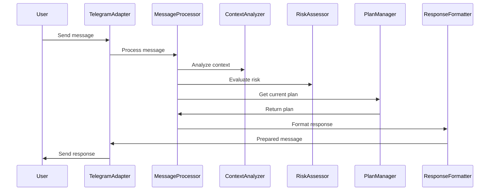

# Therapeutic Telegram Bot Implementation Progress


## MVP Technical Documentation: Therapeutic Telegram Bot (DDD Approach)

---

#### **File Structure Overview**
```markdown
src/
├── domain/               # Core business logic
│   ├── user-interaction/  
│   │   ├── entities/        # Core domain objects
│   │   ├── aggregates/      # Transaction boundaries
│   │   ├── repositories/    # Persistence interfaces
│   │   └── services/        # Domain services
│   ├── risk-management/
│   ├── plan-management/
│   └── context-analysis/
├── application/          # Use cases & coordination
│   ├── services/         
│   └── use-cases/        
├── infrastructure/       # Technical implementation
│   ├── telegram/         
│   ├── llm-integration/  
│   ├── database/         
│   └── adapters/         
├── presentation/         # Interface adapters
│   ├── controllers/      
│   ├── formatters/       
│   └── middleware/       
config/                   # Configuration files
scripts/                  # Deployment/maintenance
tests/                    # Test suites
```

---

### **Core Domain Breakdown**

#### 1. **User Interaction Domain**
**Key Files**:
- `user.entity.ts`  
  ```typescript
  interface User {
    id: string;
    riskProfile: RiskLevel;
    conversationState: ConversationState;
    planVersion: number;
  }
  ```
- `message-history.value-object.ts`  
  ```typescript
  interface MessageHistory {
    messages: TemporalMessage[];
    sentimentTrends: EmotionVector[];
    contextKeywords: string[];
  }
  ```
- `user-aggregate.root.ts` - Main transaction boundary for user interactions

#### 2. **Risk Management Domain**
**Key Files**:
- `risk-assessment.service.ts`  
  ```typescript
  class RiskAssessor {
    detectEscalationPatterns(history: MessageHistory): RiskSpectrum
    executeEmergencyProtocol(user: User): EmergencyResponse
  }
  ```
- `risk-level.value-object.ts` - Implements 4-tier risk classification

#### 3. **Plan Management Domain**
**Key Files**:
- `therapeutic-plan.aggregate.ts`  
  ```typescript
  class TherapeuticPlan {
    version: number;
    steps: PlanStep[];
    validationCheckpoints: Checkpoint[];
    effectivenessScore: number;
  }
  ```
- `plan-revision.service.ts` - Handles versioned plan updates

#### 4. **Context Analysis Domain**
**Key Files**:
- `context-monitor.service.ts`  
  ```typescript
  class ContextMonitor {
    detectContextShift(oldPlan: Plan, newMessage: string): ContextDelta
    calculateSemanticSimilarity(): ContextScore
  }
  ```
- `temporal-pattern.aggregate.ts` - Manages time-based analysis

---

### **Key File Functionality**

#### **Domain Layer**
1. `user-interaction/entities/user-profile.entity.ts`  
   - Stores core user state including current plan version and risk level
   - Maintains conversation history with temporal metadata

2. `plan-management/aggregates/plan-version-tree.aggregate.ts`  
   - Manages branching plan versions with rollback capabilities
   - Enforces validation checkpoints between steps

3. `risk-management/value-objects/risk-spectrum.vo.ts`  
   - Implements 4-level risk classification system
   - Contains escalation thresholds and protocol mappings

#### **Application Layer**
1. `services/message-processing.service.ts`  
   ```typescript
   class MessageProcessor {
     async handleMessage(message: TelegramMessage) {
       // Coordinates domain services
       const context = await contextAnalyzer.analyze(message);
       const risk = await riskAssessor.evaluate(message);
       const plan = await planManager.getCurrentPlan();
       return responseGenerator.createResponse(context, risk, plan);
     }
   }
   ```

2. `use-cases/plan-revision.use-case.ts`  
   - Orchestrates silent plan updates when context shifts
   - Maintains version history and effectiveness metrics

#### **Infrastructure Layer**
1. `telegram/telegram-bot.adapter.ts`  
   - Implements Telegram Bot API interface
   - Maps Telegram messages to domain models

2. `llm-integration/llm-gateway.adapter.ts`  
   - Unified interface for multiple LLM providers
   - Implements retry/circuit breaker patterns

#### **Presentation Layer**
1. `formatters/response-formatter.ts`  
   ```typescript
   class ResponseFormatter {
     formatForStyle(userStyle: CommunicationStyle): string {
       // Adapts responses to user's preferred format
     }
   }
   ```

2. `middleware/context-logger.middleware.ts`  
   - Captures conversation context for audit trails
   - Enriches logs with domain-specific metadata

---

### **Key DDD Components**

1. **Aggregates**:
   - `UserAggregate`: Root entity for all user interactions
   - `PlanVersionAggregate`: Maintains plan consistency boundaries

2. **Value Objects**:
   - `RiskLevel`: Enum with tiered risk classification
   - `ContextScore`: Semantic similarity measurement

3. **Repositories**:
   - `UserRepository`: Persists user state and history
   - `PlanRepository`: Manages versioned plan storage

4. **Domain Events**:
   - `RiskLevelChangedEvent`: Triggers emergency protocols
   - `PlanRevisedEvent`: Updates validation checkpoints

---

### **Workflow Implementation**



---

### **Technical Highlights**

1. **State Management**:
   - Conversation state machine with 5 core states
   - Plan version tree with automatic rollback points

2. **Adaptive Communication**:
   ```typescript
   enum CommunicationStyle {
     ANALYTICAL = 'analytical',
     EMOTIONAL = 'emotional',
     VISUAL = 'visual'
   }
   ```

3. **Performance**:
   - 3-layer caching (in-memory, Redis, DB)
   - Async processing for non-critical path operations

4. **Safety**:
   - Circuit breakers for LLM calls
   - Automatic failover to safe responses
 


## Implementation Tracking

### Directory Structure Setup
- [x] Create main directory structure
- [x] Set up domain subdirectories
- [x] Set up application subdirectories
- [x] Set up infrastructure subdirectories
- [x] Set up presentation subdirectories
- [x] Set up config, scripts, and tests directories

### Core Domain Implementation
- [x] User Interaction Domain
  - [x] User Entity
  - [x] Conversation State Value Object
  - [x] Message History Value Object
  - [x] User Aggregate
- [x] Risk Management Domain
  - [x] Risk Level Value Object
  - [x] Risk Assessment Service with LLM
- [x] Plan Management Domain
  - [x] Therapeutic Plan Value Objects
  - [x] Therapeutic Plan Aggregate
- [x] Context Analysis Domain
  - [x] Context Monitor Service with LLM

### Key Files Implementation
- [x] Domain Layer
  - [x] Core domain models
  - [x] LLM-enabled services
- [x] Application Layer
  - [x] Message Processing Service with LLM
- [x] Infrastructure Layer
  - [x] LLM Gateway Adapter
  - [x] Telegram Bot Adapter
- [x] Presentation Layer
  - [x] Response Formatter with LLM
  - [x] Bot Controller

### Additional Components
- [x] Add TypeScript configurations
- [x] Set up package dependencies
- [x] Create Docker configuration
- [x] Create environment configuration
- [x] Write README documentation

# Implementation Progress

## Current Status

✓ MVP Implementation Complete

## Implemented Components

### Core Domain (✓ DONE)
- [x] Conversation Models & States
- [x] Prompts System
- [x] State Management
- [x] Message Processing
- [x] LLM Integration

### Infrastructure (✓ DONE)
- [x] Session Repository (In-Memory)
- [x] Telegram Bot Integration
- [x] Application Bootstrap

## Architecture Overview

```
[Telegram Bot] → [Session Repository] → [Message Processor] → [LLM Service]
                                            ↑
                                     [State Manager]
```

## Key Features

1. **State Machine**
   - Handles conversation flow
   - Manages transitions between states
   - Detects critical situations

2. **Message Processing**
   - Integrated with LLM for responses
   - Background analysis capability
   - Multi-tier model support

3. **Session Management**
   - In-memory storage
   - Context preservation
   - History tracking

4. **LLM Integration**
   - Two-tier model support
   - Error handling
   - Response formatting

## Configuration Options

Environment variables:
- TELEGRAM_BOT_TOKEN
- OPENAI_API_KEY
- NODE_ENV
- WEBHOOK_URL (optional)
- LOW_TIER_MODEL (default: gpt-3.5-turbo)
- HIGH_TIER_MODEL (default: gpt-4-turbo-preview)
- ENABLE_BACKGROUND_PROCESSING

## Next Steps

1. Testing
   - [ ] Unit tests for core services
   - [ ] Integration tests for bot commands
   - [ ] End-to-end conversation flow tests

2. Potential Enhancements
   - [ ] Persistent storage for sessions
   - [ ] Advanced error recovery
   - [ ] Analytics and monitoring
   - [ ] Rate limiting
   - [ ] Message queue for background tasks

## Notes

- MVP maintains full functionality while keeping implementation minimal
- Original prompts preserved and integrated into new architecture
- State machine provides better conversation control
- Ready for testing and future enhancements

## Architecture Highlights

### LLM Integration
- Risk assessment uses LLM for detecting potential issues
- Context analysis uses LLM for understanding conversation themes
- Response generation uses LLM for creating therapeutic responses
- Plan adaptation uses LLM for creating therapeutic strategies
- Style formatting uses LLM for adapting communication styles

### Safety Features
- Circuit breaker pattern for LLM API resilience
- Risk escalation protocol
- Conservative fallbacks for all LLM operations

## Next Steps
1. Testing
   - [ ] Unit tests for domain services
   - [ ] Integration tests for bot interactions
   - [ ] End-to-end tests for full conversation flows
2. Data Persistence
   - [ ] Implement session repository for persistent storage
   - [ ] Add database adapter
3. Monitoring
   - [ ] Add logging and monitoring
   - [ ] Implement metrics collection
4. Extended Features
   - [ ] User preference management
   - [ ] Multi-language support
   - [ ] Media message handling